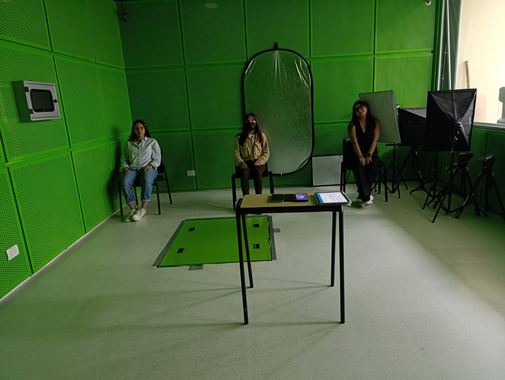

# LABORATORIO #2 PROCESAMIENTO DIGITAL DE SEÑALES

## Tabla de Contenidos
1. [Objetivo y Metodología del Experimento](#objetivo-y-metodología-del-experimento)
2. [Configuración Del Sistema](#configuración-del-sistema)
3. [Captura De La Señal](#captura-de-la-señal)
4. [Fragmentos Clave Del Código Construido](#fragmentos-clave-del-código-construido)
5. [Análisis De Los Resultados](#análisis-de-resultados)

## OBJETIVO Y METODOLOGÍA DEL EXPERIMENTO
El objetivo principal de este experimento fue desarrollar una solución para el fenómeno conocido como "Fiesta de coctel", que consiste en la capacidad de concentrarse en una fuente sonora específica mientras se filtran otras fuentes en un entorno con múltiples emisores de sonido. En este caso, se diseñó un sistema capaz de aislar una única voz entre tres personas hablando simultáneamente.
Para garantizar condiciones controladas, el experimento se realizó en un cuarto insonorizado, minimizando así la interferencia de ruidos externos y asegurando la calidad de la grabación. En cuanto al diseño experimental, se pidió a los tres emisores (las tres personas) que generaran voces en diferentes rangos tonales (grave, medio y agudo), con el fin de facilitar la separación de las señales y poder identificar la voz de interés, que en este caso fue la de tono grave.
## CONFIGURACIÓN DEL SISTEMA
Los emisores de sonido se ubicaron a una distancia de 55 cm entre sí, formando una línea horizontal. Los micrófonos, dispuestos de manera lineal sobre una mesa a 1.5 metros de distancia de los emisores, se colocaron con una separación de 2 cm entre ellos e inclinados hacia las personas, optimizando la captura de la voz más cercana a cada micrófono. Esta configuración buscó minimizar la interferencia entre las señales capturadas y mejorar la diferenciación espacial de las fuentes sonoras.
Para la grabación, se utilizaron tres dispositivos móviles: Xiaomi Redmi Note 13, Xiaomi Redmi Note 13 Pro y TECNO Spark 20C, todos ellos a través de la aplicación RecForge II, que garantizaba una frecuencia de muestreo uniforme de 44.1 kHz en todos los micrófonos. Esta frecuencia se seleccionó debido a su estandarización en la industria del audio, particularmente para la grabación de música y voz. Además, proporciona un margen de seguridad sobre los 40 kHz requeridos según el teorema de Nyquist, evitando la pérdida de detalles en las frecuencias más altas y reduciendo el riesgo de aliasing.(fenómeno que ocurre cuando una señal es muestreada a una frecuencia insuficiente)
Para un análisis riguroso, también se grabó el ruido ambiental en cada micrófono sin la presencia de voces. Este paso fue crucial para evaluar la calidad de la separación de fuentes, permitiendo comparar las señales de interés con el ruido capturado. Este análisis será abordado en detalle en la sección "Análisis" del presente informe.
A continuación, se presenta la evidencia experimental obtenida:
<div align="center">
  
</div>
   
## CAPTURA DE LA SEÑAL
## FRAGMENTOS CLAVE DEL CÓDIGO CONSTRUIDO

Librerias necesarias:

```python
import librosa
import numpy as np
import soundfile as sf
import matplotlib.pyplot as plt
from scipy.signal import butter, lfilter
```


Funciones para creación de filtro pasabajos y su aplicación respectivamente:

```python
def butter_lowpass(cutoff, fs, order=5):
    nyq = 0.5 * fs
    normal_cutoff = cutoff / nyq
    b, a = butter(order, normal_cutoff, btype='low', analog=False)
    return b, a

def lowpass_filter(data, cutoff, fs, order=5):
    b, a = butter_lowpass(cutoff, fs, order=order)
    y = lfilter(b, a, data)
    return y
```

A continuación se mostraran distintos procesos hechos con las señales en los que se visualiza el fragmento de código correspondiente a una variable, entendiendo que para aplicarlo a las otras señales simplemente se debe aplicar el cambio de variable respectivo. 

Con lo anterior, se importa el audio del micrófono 1 y se realiza la separación de la voz grave así:

```python
audio_file = '1MICHEL Y ELI.wav'
y, sr = librosa.load(audio_file, sr=None, mono=False)

if y.ndim > 1:
    y = librosa.to_mono(y)

cutoff_freq = 800.0  
y_filtered = lowpass_filter(y, cutoff_freq, sr, order=12)
output_file = 'voz_grave_filtrada1.wav'
sf.write(output_file, y_filtered, sr)
print(f"Archivo guardado: {output_file}")

```
Luego de repetir el proceso para cada señal, se realiza la reconstrucción total de la señal aislada, la cual corresponde a la suma de la voz grave aislada en cada caso, haciendo uso del siguiente código:

```python
min_length = min(len(y_filtered), len(y2_filtered), len(y3_filtered))
y_filtered = y_filtered[:min_length]
y3_filtered = y3_filtered[:min_length]
y2_filtered = y2_filtered[:min_length]

summed_signal = y_filtered + y2_filtered + y3_filtered

#Se normaliza la señal
summed_signal = summed_signal / np.max(np.abs(summed_signal))

output_file_summed = 'voz_grave_sumada.wav'
sf.write(output_file_summed, summed_signal, sr)
print(f"Archivo guardado: {output_file_summed}")

```

Como se  mencionó en la metodología del experimento, se realizó en cada caso la grabación del ruido ambiental (grabación con mismas condiciones sin la presencia de las voces), para determinar en cada caso cual era el SNR correspondiente, como se muestra a continuación:

```python
#SNR PARA PRIMERA SEÑAL:

ruido_1 = '1SILENCIO.wav'
ruido_y, sr = librosa.load(audio_file, sr=None, mono=False)

min_length = min(len(y), len(ruido_y))
y = y[:min_length]
ruido_y = ruido_y[:min_length]


PRIMERA_squared = np.square(y)
sumatoria_PRIMERA = np.sum(PRIMERA_squared)
resultado_potencia_PRIMERA = sumatoria_PRIMERA / len(y)


ruido_squared = np.square(ruido_y)
sumatoria_ruido = np.sum(ruido_squared)
resultado_potencia_ruido = sumatoria_ruido / len(ruido_y)

SNR=10*np.log10(resultado_potencia_PRIMERA/resultado_potencia_ruido)

print("SNR PARA PRIMER MICRÓFONO (dB):", SNR)

```

Para este punto se obtuvieron los siguientes resultados:

<div align="center">
  
</div>

## ANÁLISIS DE RESULTADOS


