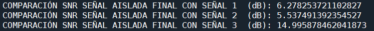

# LABORATORIO #2 PROCESAMIENTO DIGITAL DE SEÑALES

## Tabla de Contenidos
1. [Objetivo y Metodología del Experimento](#objetivo-y-metodología-del-experimento)
2. [Configuración Del Sistema y Captura De La Señal](#configuración-del-sistema-y-captura-de-la-señal)
3. [Fragmentos Clave Del Código Construido](#fragmentos-clave-del-código-construido)
4. [Análisis De Los Resultados](#análisis-de-resultados)

## OBJETIVO Y METODOLOGÍA DEL EXPERIMENTO
El objetivo principal de este experimento fue desarrollar una solución para el fenómeno conocido como "Fiesta de coctel", que consiste en la capacidad de concentrarse en una fuente sonora específica mientras se filtran otras fuentes en un entorno con múltiples emisores de sonido. En este caso, se diseñó un sistema capaz de aislar una única voz entre tres personas hablando simultáneamente.
Para garantizar condiciones controladas, el experimento se realizó en un cuarto insonorizado, minimizando así la interferencia de ruidos externos y asegurando la calidad de la grabación. En cuanto al diseño experimental, se pidió a los tres emisores (las tres personas) que generaran voces en diferentes rangos tonales (grave, medio y agudo), con el fin de facilitar la separación de las señales y poder identificar la voz de interés, que en este caso fue la de tono grave.
## CONFIGURACIÓN DEL SISTEMA Y CAPTURA DE LA SEÑAL
Los emisores de sonido se ubicaron a una distancia de 55 cm entre sí, formando una línea horizontal. Los micrófonos, dispuestos de manera lineal sobre una mesa a 1.5 metros de distancia de los emisores, se colocaron con una separación de 2 cm entre ellos e inclinados hacia las personas, optimizando la captura de la voz más cercana a cada micrófono. Esta configuración buscó minimizar la interferencia entre las señales capturadas y mejorar la diferenciación espacial de las fuentes sonoras.


Para la grabación, se utilizaron tres dispositivos móviles: Xiaomi Redmi Note 13, Xiaomi Redmi Note 13 Pro y TECNO Spark 20C, todos ellos a través de la aplicación RecForge II, que garantizaba una frecuencia de muestreo uniforme de 44.1 kHz en todos los micrófonos. Esta frecuencia se seleccionó debido a su estandarización en la industria del audio, particularmente para la grabación de música y voz. Además, proporciona un margen de seguridad sobre los 40 kHz requeridos según el teorema de Nyquist, evitando la pérdida de detalles en las frecuencias más altas y reduciendo el riesgo de aliasing.(fenómeno que ocurre cuando una señal es muestreada a una frecuencia insuficiente). De esta manera se ejecutó un tiempo de captura de 5 segundos donde cada una de las personas dice las siguientes oraciones: 
- Persona 1 (Tono grave): “Me gusta el futbol y me llamo Michel”
- Persona 2 (Tono normal): “Yo practico patinaje y me llamo Eliana”
- Persona 3 (Tono agudo): “Yo juego voleibol y me llamo Karen”

  
Una vez realizadas las grabaciones, se hizo uso del formato de archivo WAV. La resolución en bits utilizada para la cuantificación de las señales de audio es un factor clave en la calidad de la grabación, para el caso, la aplicación RecForge II en los dispositivos móviles especifica que la cuantificación se realiza a 16 bits, implicando que cada muestra de audio es representada con una profundidad de dicho valor, permitiendo 65,536 niveles de cuantificación posibles. Esta cantidad de niveles proporciona una representación precisa de las señales de audio y ayuda a minimizar el error de cuantificación, que puede causar distorsión o pérdida de calidad en la señal.
A continuación, se presenta la evidencia experimental obtenida:
<div align="center">
  
</div>
Para un análisis riguroso, también se grabó el ruido ambiental en cada micrófono sin la presencia de voces. Este paso fue crucial para evaluar la calidad de la separación de fuentes, permitiendo comparar las señales de interés con el ruido capturado. En total se calcularon nueve SNR, clasificándose de la siguiente manera:


- SNR PARA CADA MICRÓFONO: Para el cálculo de este SNR se hizo la relación entre la potencia de la grabación de las voces del micrófono específico (1,2 y 3) y la potencia del ruido grabado por cada micrófono. 

- COMPARACIÓN SNR SEÑAL AISLADA: Para el calculo de este SNR se hizo la relación entre la potencia de la señal aislada en cada micrófono (voz grave para micrófono 1, 2 y 3) y la potencia de la grabación de las voces del micrófono específico.


- COMPARACIÓN SEÑAL AISLADA FINAL: Para el calculo de este SNR se hizo la relación entre la potencia de la señal deseada final (resultado de la suma de las tres señales de interés) y la potencia de la grabación de las voces del micrófono específico (1,2 y 3).


Este análisis será abordado en detalle en la sección "Análisis" del presente informe.

   
## FRAGMENTOS CLAVE DEL CÓDIGO CONSTRUIDO

Librerias necesarias:

```python
import librosa
import numpy as np
import soundfile as sf
import matplotlib.pyplot as plt
from scipy.signal import butter, lfilter
```


Funciones para creación de filtro pasabajos y su aplicación respectivamente:

```python
def butter_lowpass(cutoff, fs, order=5):
    nyq = 0.5 * fs
    normal_cutoff = cutoff / nyq
    b, a = butter(order, normal_cutoff, btype='low', analog=False)
    return b, a

def lowpass_filter(data, cutoff, fs, order=5):
    b, a = butter_lowpass(cutoff, fs, order=order)
    y = lfilter(b, a, data)
    return y
```

A continuación se mostraran distintos procesos hechos con las señales en los que se visualiza el fragmento de código correspondiente a una variable, entendiendo que para aplicarlo a las otras señales simplemente se debe aplicar el cambio de variable respectivo. 

Con lo anterior, se importa el audio del micrófono 1 y se realiza la separación de la voz grave así:

```python
audio_file = '1MICHEL Y ELI.wav'
y, sr = librosa.load(audio_file, sr=None, mono=False)

if y.ndim > 1:
    y = librosa.to_mono(y)

cutoff_freq = 800.0  
y_filtered = lowpass_filter(y, cutoff_freq, sr, order=12)
output_file = 'voz_grave_filtrada1.wav'
sf.write(output_file, y_filtered, sr)
print(f"Archivo guardado: {output_file}")

```
Luego de repetir el proceso para cada señal, se realiza la reconstrucción total de la señal aislada, la cual corresponde a la suma de la voz grave aislada en cada caso, haciendo uso del siguiente código:

```python
min_length = min(len(y_filtered), len(y2_filtered), len(y3_filtered))
y_filtered = y_filtered[:min_length]
y3_filtered = y3_filtered[:min_length]
y2_filtered = y2_filtered[:min_length]

summed_signal = y_filtered + y2_filtered + y3_filtered

#Se normaliza la señal
summed_signal = summed_signal / np.max(np.abs(summed_signal))

output_file_summed = 'voz_grave_sumada.wav'
sf.write(output_file_summed, summed_signal, sr)
print(f"Archivo guardado: {output_file_summed}")

```

Como se  mencionó en la metodología del experimento, se realizó en cada caso la grabación del ruido ambiental (grabación con mismas condiciones sin la presencia de las voces), para determinar en cada caso cual era el SNR correspondiente, como se muestra a continuación:

```python
#SNR PARA PRIMERA SEÑAL:

ruido_1 = '1SILENCIO.wav'
ruido_y, sr = librosa.load(audio_file, sr=None, mono=False)

min_length = min(len(y), len(ruido_y))
y = y[:min_length]
ruido_y = ruido_y[:min_length]


PRIMERA_squared = np.square(y)
sumatoria_PRIMERA = np.sum(PRIMERA_squared)
resultado_potencia_PRIMERA = sumatoria_PRIMERA / len(y)


ruido_squared = np.square(ruido_y)
sumatoria_ruido = np.sum(ruido_squared)
resultado_potencia_ruido = sumatoria_ruido / len(ruido_y)

SNR=10*np.log10(resultado_potencia_PRIMERA/resultado_potencia_ruido)

print("SNR PARA PRIMER MICRÓFONO (dB):", SNR)

```

Para este punto se obtuvieron los siguientes resultados:

<div align="center">
  
</div>

Como ya sabemos, previamente fue generada una señal aislada para cada micrófono, la cual es la señal de interés, siendo así la grabacion inicial que contiene las voces se converitiría en el "ruido" para esta compraración hecha mediante SNR, haciendo uso del siguiente código:

```python
#COMPARACIÓN DE SEÑAL AISLADA CON LA ORIGINAL DE CADA MICRÓFONO


#Para micrófono 1:
    
y_filtered_squared = np.square(y_filtered)
sumatoria_y_filtered = np.sum(y_filtered_squared)
resultado_potencia_y_filtered = sumatoria_y_filtered / len(y_filtered)

SNR_Aislada_1= 10*np.log10(resultado_potencia_y_filtered/resultado_potencia_PRIMERA)

print("COMPARACIÓN SNR SEÑAL AISLADA 1 CON SEÑAL 1  (dB):", SNR_Aislada_1)

```

Esto arrojó los siguientes resultados:

<div align="center">
  
</div>


Ahora se comparará la señal aislada reconstruida con la señal que contiene las voces para cada mircófono:

```python

#COMPARACIÓN DE SEÑAL AISLADA FINAL CON LA ORIGINAL DE CADA MICRÓFONO

#Para micrófono 1:
    
summed_signal = np.square(summed_signal)
sumatoria_summed_signal = np.sum(summed_signal)
resultado_potencia_summed_signal = sumatoria_summed_signal / len(summed_signal)

SNR_Aislada_FIN1= 10*np.log10(resultado_potencia_summed_signal/resultado_potencia_PRIMERA)

print("COMPARACIÓN SNR SEÑAL AISLADA FINAL CON SEÑAL 1  (dB):", SNR_Aislada_FIN1)

```
Lo anterior permitió obtener los siguientes valores:

<div align="center">
  
</div>

```python

Finalmente se realiza el análisis temporal y espectral de cada señal, como se ejemplifica:

#ANÁLISIS TEMPORAL Y ESPECTRAL DE LA SEÑAL 1 :


#Análisis Temporal:

plt.figure(figsize=(12, 6))
plt.title('Señal Micrófono 1')
plt.xlabel('Tiempo (Segundos)')
plt.ylabel('dB')
librosa.display.waveshow(y, sr=sr)
plt.tight_layout()
plt.show()


#Análisis Espectral:


N = len(y)  
Y = np.fft.fft(y) 
frequencies = np.fft.fftfreq(N, 1/sr)  

half_N = N // 2
Y_half = Y[:half_N] 
frequencies_half = frequencies[:half_N]  

magnitude = np.abs(Y_half)

plt.figure(figsize=(14, 5))
plt.plot(frequencies_half, magnitude)
plt.title('Espectro de Frecuencia de la Señal 1')
plt.xlabel('Frecuencia (Hz)')
plt.ylabel('Magnitud')
plt.xlim(0, sr/2)  
plt.grid()
plt.show()

```
De forma gráfica se puede visualizar este análisis para cada caso de la siguiente forma:

### Micrófono 1:

<div align="center">
  
</div>

<div align="center">
  
</div>

### Micrófono 2:

<div align="center">
  
</div>

<div align="center">
  
</div>

### Micrófono 3:

<div align="center">
  
</div>

<div align="center">
  
</div>

## ANÁLISIS DE RESULTADOS

De los SNR para cada micrófono, se pudo analizar lo siguiente:
- Para el primer micrófono que arrojó un valor de 0 dB se puede encontrar la justificación de dicho valor debido a que ambas señales contaban con la misma potencia.
- Para los otros dos casos no se logró obtener un valor ideal ya que el SNR arrojado para cada caso fue de -6.0307 dB y -22.8233 dB respectivamente.
- Finalmente de lo anterior podemos concluir que por las características de cada micrófono la potencia de la señal podría ser más alta o no.
  
Para la comparación de la señal aislada con la grabación inicial en cada caso se obtuvieron los valores:

- Micrófono 1: -3.0047 dB
- Micrófono 2: -2.4074 dB
- Micrófono 3: -1.7146 dB
  
Podemos notar como se obtienen resultados más altos y por endes mejores respecto a la cercanía entre el micrófono y la persona emisora del tono grave


## ANEXOS

